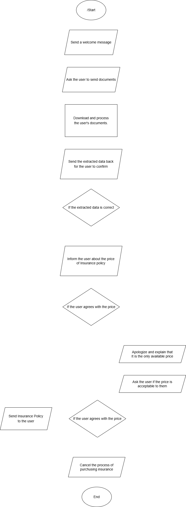

# CarInsuranceSalesBot

A Telegram bot that assists users in purchasing car insurance by processing user-submitted documents and confirming transaction details. <br>
Here is the link to the bot - [click](https://t.me/insuro_bot)

## Setup Instructions

### Prerequisites
Make sure you have the following installed:
- [.NET 8 SDK](https://dotnet.microsoft.com/en-us/download/dotnet/8.0)
- [Git](https://git-scm.com/)
- [Visual Studio 2022+](https://visualstudio.microsoft.com/)

### How to Run the Project

1. **Clone the repository:**
```sh
  git clone https://github.com/RomanVintoniak/CarInsuranceSales.git
```

2. **Restore dependencies:**
```sh
  dotnet restore
```

3. **Build the project**
```sh
  dotnet build
```

4. **Run the API**
```sh
  dotnet run
```

### Configuration
Before running the application, configure the following values in the `appsettings.json` file:
```json
{
  "TelegramBotToken": "your-telegram-bot-token-here",
  "MindeeApiKey": "your-mindee-api-key-here",
  "OpenAiApiKey": "your-openai-api-key-here",
  "PolicyDocumentUrl": "https://your-url-to-the-policy-document"
}
```

## Dependencies
The project uses the following NuGet packages:
- Mindee - Used for integrating with [Mindee](https://www.mindee.com/) document processing API
- OpenAI - A .NET SDK for interacting with the [OpenAI API](https://platform.openai.com/docs/overview)
- Telegram.Bot - .NET client for the [Telegram Bot API](https://core.telegram.org/bots/api)

## Detailed description of the bot workflow.
